# std-db
A command line tool(CLT) to interact with student data excel sheets 

## Sequence Diagram

```mermaid
sequenceDiagram
    participant 👤User 
    participant 🧠System
    participant 📚VectorDB
    participant 🤖LLM
    participant 🗄️SQLite

    👤User->>🧠System: Natural Language Query
    🧠System->>📚VectorDB: Find similar queries
    📚VectorDB-->>🧠System: Top 3 (NLQ, SQL) pairs
    🧠System->>🤖LLM: Generate SQL with RAG prompt
    🤖LLM-->>🧠System: SQL response
    🧠System->>🗄️SQLite: Execute query
    🗄️SQLite-->>🧠System: Results
    🧠System->>👤User: Show results
    🧠System->>📚VectorDB: Store successful query
```



## Features.
- Query student information in Natural language
- Reading the file containing the data
- Utilise LLM for processing NLP
- store chat histroy

## Installation
1. Clone the repository:
    ```bash
    git clone https://github.com/yourusername/std-db.git
    ```
2. Navigate to the project directory:
    ```bash
    cd std-db
    ```
3. Install dependencies:
    ```
    pip install -r requirements
    ```

## Usage
1. Start the application:
    ```bash
    python3 app.py
    ```

## Future works
- Add support for additional file formats like CSV and JSON.
- fine tuning  the NLP model by implementing RAG
- Implement a graphical user interface (GUI) for easier interaction.
- Optimize performance for handling large datasets.
- Implement a feature for data visualization.
